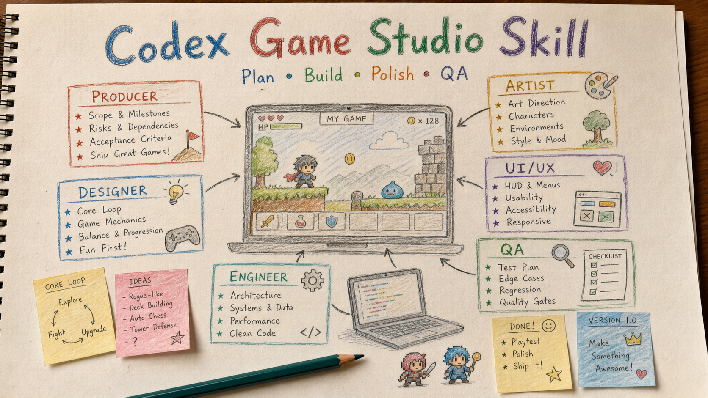
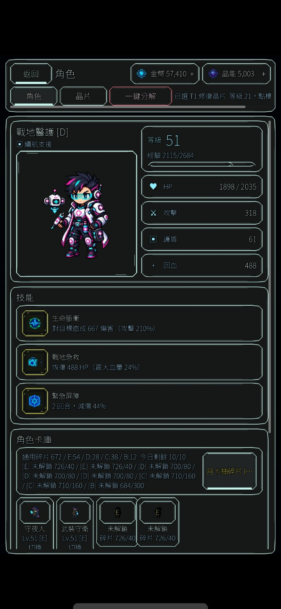

# Codex Game Studio Skill

[中文](README.md) | **English**



<!-- showcase-start -->
## Game Showcase

These three games show the kind of production work this `$gamestudio` skill is designed to support: gameplay planning, UI/HUD design, asset planning, mission systems, QA, polish, and store-readiness checks. Each game is shown separately so visitors can understand the game type and the output surface clearly.

### Taiwan Justice Street

A Taiwan-themed street action game showcase. This type of project benefits from `$gamestudio` for character planning, level pacing, game feel, mission flow, and store-readiness review.

- [Try it on Google Play](https://play.google.com/store/apps/details?id=com.dreamgame.taiwanjusticestreet&pcampaignid=web_share)
- [Gameplay video](assets/showcase/taiwan-justice-street/gameplay.mp4)

### Sequence Decipher

A sci-fi battle, auto-combat, and character progression showcase. This type of project benefits from `$gamestudio` for battle loops, character panels, mission systems, chip inventory, numeric feedback, and long-running phase handoff.

- [Try it on Google Play](https://play.google.com/store/apps/details?id=com.guangyuspace.sequencedecipher&pcampaignid=web_share)
- [Gameplay video](assets/showcase/sequence-decipher/gameplay.mp4)

<p>
  
  
  
  
  
</p>

### Bonus Hoops

A casual pachinko/basketball and multilingual UI showcase. This type of project benefits from `$gamestudio` for core-loop design, shop upgrades, pet skills, settings screens, localization, mobile layout, and QA checks.

- [Try it on Google Play](https://play.google.com/store/apps/details?id=com.bearball.bonushoops&pcampaignid=web_share)
- [Gameplay video](assets/showcase/bonus-hoops/gameplay.mp4)

<p>
  
  
</p>

Questions, feedback, or progress updates: [@sequence_decipher on Threads](https://www.threads.com/@sequence_decipher)
<!-- showcase-end -->

An end-to-end Codex game-production skill that applies a veteran cross-functional quality bar across design, development, testing, optimization, release, and live operation while preserving minimal working changes, root-cause-first debugging, and evidence-based delivery.

It supports Godot, Unity, Phaser, WebGL, mobile and desktop games, vertical slices, gameplay, combat, levels, quests, progression, economy, live ops, analytics, UI/HUD, accessibility, localization, audio, art assets, saves, IAP, performance, CI, and store release.

> "Major-studio team mode" means rigorous cross-functional review. It does not imply affiliation with, employment by, or endorsement from any game company, and it does not copy proprietary process, code, art, or intellectual property.

## What It Does

When activated, Codex selects only the perspectives needed by the task:

- Producer: scope, milestones, risk, acceptance criteria, and delivery evidence
- Creative/Game Director: player fantasy, pillars, originality, and experience tradeoffs
- Systems/Combat Design: core loop, combat rhythm, counterplay, difficulty, and tuning models
- Level/Quest Design: teaching, testing, twists, mastery, navigation, and pacing
- Economy/Live Ops: sources and sinks, progression, shops, events, experiments, and rollback
- Gameplay/Platform/Release Engineering: state ownership, saves, IAP, performance, CI, and packaging
- Game Feel: input response, feedback, camera, animation, audio, and control feel
- UI/UX: HUD, menus, shops, inventory, touch, accessibility, and localization
- Art/Tech Art/Audio: direction, asset specifications, performance budgets, and integration
- QA/Research/Analytics/Security: test matrices, player observation, telemetry, privacy, and abuse risk

It does not pretend to run multiple background agents. One Codex instance uses explicit decision ownership to choose the smallest necessary set of professional perspectives.

## Comprehensive Production Upgrade

The upgraded skill moves from merely completing features to delivering testable player outcomes safely:

- `production-design.md`: MDA, pillars, core loops, vertical slices, combat, bosses, levels, quests, progression, onboarding, difficulty, and playtests
- `engineering-quality.md`: architecture and state ownership, save migration, purchase lifecycle, multiplayer, performance budgets, testing, CI, release, telemetry, and privacy
- `economy-liveops.md`: sources and sinks, rewards, randomness, ethical monetization, shops, ads, subscriptions, funnels, experiments, Remote Config, events, and incidents
- `ui-ux-audit.md`: mobile typography, HUD density, hierarchy, touch, color, onboarding, retention, store-rating risk, and Godot UI structure

Each production phase has a gate: Prototype proves the core fun, Vertical Slice proves representative quality, Production controls content cost, Alpha reaches feature completeness, Beta burns down stability and launch risk, Release requires traceable artifacts, and Live Ops requires monitoring, kill switches, and rollback.

Public sources are used to synthesize verifiable principles. Third-party prose, code, and assets are not copied. See `NOTICE.md` and `references/source-boundary.md` for sources, licenses, and usage boundaries.

## Mobile Game UI/UX Quality Gate

`$gamestudio` treats UI as a retention and usability concern, not surface decoration. It must load `references/ui-ux-audit.md` for UI, HUD, menu, shop, inventory, phone-layout, small-text, clutter, hard-to-tap controls, added permanent information, and pre-release tasks.

The audit prioritizes:

- type size, outline, spacing, background interference, and CJK/English overflow on a six-inch phone
- overloaded or duplicated HUD information that should be folded, muted, or moved to a detail view
- first-glance hierarchy, touch targets, thumb reach, and accidental-tap risk
- contrast, accent-color count, first-30-second comprehension, and desire to continue
- Godot `Control`, `Container`, anchors, offsets, minimum sizes, and `Theme` ownership

New features must not add permanent battle HUD information without first proposing consolidation, contextual reveal, folding, or a separate detail view. Every audit ends with a consistent UI Score, P0-P4 priorities, and release-validation result.

## Asset Workflows

- characters, creatures, props, projectiles, effects, and animation sheets route to the sprite workflow
- maps, levels, battle backgrounds, tilemaps, parallax scenes, and collision zones route to the map workflow
- transparent extraction and chroma key request solid green `#00FF00` first; magenta `#FF00FF` is used only when green conflicts with the subject or cleanup fails
- sound effects, BGM, loops, stingers, mixing, and engine audio buses route to the game-audio workflow

## Long Project Handoff

For long projects, multi-phase work, debugging, or likely context compression, the skill creates or updates a project-local `CODEX_HANDOFF.md`. When the same error survives repeated fixes, it first creates or updates `DEBUG_HANDOFF.md` with symptoms, reproduction, failed attempts, root-cause hypotheses, and the next validation step; code changes stop until evidence supports a root cause.

Each substantial response ends with:

```text
【交接狀態】
- CODEX_HANDOFF.md 是否已更新：
- DEBUG_HANDOFF.md 是否已更新：
- 本次修改檔案：
- 測試結果：
- 目前風險：
- 下一個最安全任務：
```

## Install

Copy this folder into your Codex skills directory:

```powershell
Copy-Item -Recurse -Force . "$env:USERPROFILE\.codex\skills\gamestudio"
```

Restart Codex after installation, then invoke `$gamestudio` explicitly in your message.

## Usage

```text
$gamestudio Plan and complete the next playable milestone of this Godot game.
```

```text
$gamestudio Review this build with a veteran cross-functional game-team quality bar across gameplay, combat, economy, performance, saves, IAP, UI, and release risk.
```

```text
$gamestudio Audit this mobile HUD for typography, hierarchy, touch, and Google Play rating risk, then fix the P0 issues.
```

## Repository Layout

```text
SKILL.md
agents/
  openai.yaml
references/
  asset-routing.md
  economy-liveops.md
  engineering-quality.md
  godot.md
  handoff-debug.md
  minimal-workflow.md
  production-design.md
  roles.md
  source-boundary.md
  templates.md
  ui-ux-audit.md
  workflows.md
```

## Attribution

This Codex skill was originally inspired by and redesigned from:

- https://github.com/pamirtuna/gamestudio-subagents
- https://github.com/DietrichGebert/ponytail
- https://github.com/0x0funky/agent-sprite-forge

This upgrade also consulted public official material from Godot, Unity, Phaser, Android, Google Play, Apple, Xbox Accessibility, Firebase, and PlayFab; the MDA paper; and public practices from MIT-licensed projects such as GUT, GdUnit4, and GameCI.

This repository does not bundle or execute those projects' full runtimes, scripts, documentation, or assets. It reorganizes verifiable professional principles into a Codex-native `gamestudio` skill. See `NOTICE.md` and `references/source-boundary.md` for exact links, licenses, and cautions.

## License

MIT License. See `LICENSE`.
