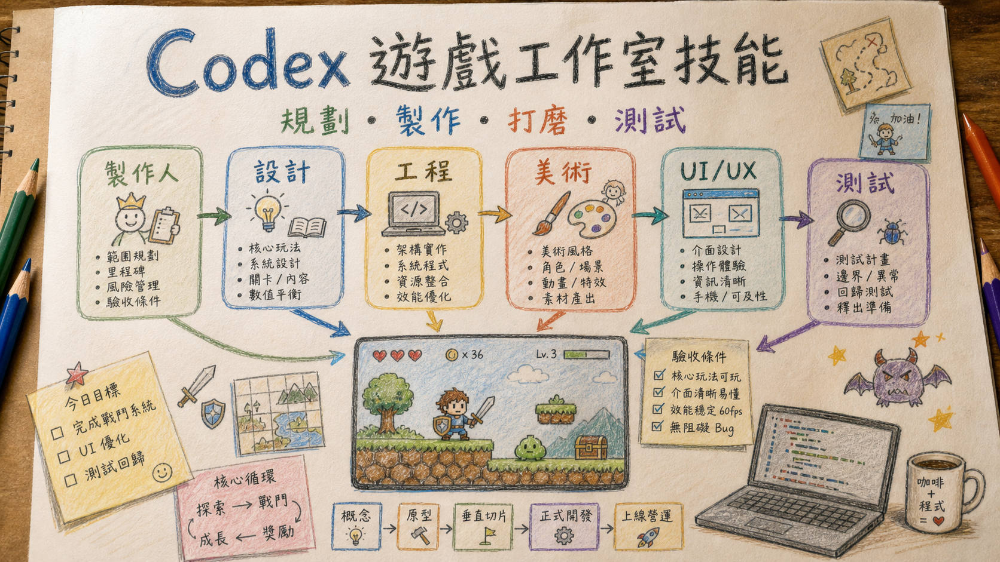

# Codex 遊戲工作室技能

**中文** | [English](README.en.md)



<!-- showcase-start -->
## 實際遊戲展示

以下三款是這個 `$gamestudio` skill 想展示的成果方向：Codex 可以協助你從玩法規劃、UI/HUD、素材需求、任務系統、QA、打磨到上架前檢查，把遊戲拆成可完成的階段。每款遊戲分開展示，讓你清楚看到不同類型的製作成果。

### 台灣正義街

街頭動作 / 台灣題材遊戲展示。這類專案適合用 `$gamestudio` 拆解角色、關卡節奏、操作手感、任務流程與商店上架檢查。

- [Google Play 體驗](https://play.google.com/store/apps/details?id=com.dreamgame.taiwanjusticestreet&pcampaignid=web_share)
- [Gameplay video](assets/showcase/taiwan-justice-street/gameplay.mp4)

### Sequence Decipher

科幻戰鬥 / 自動戰鬥 / 角色養成展示。這類專案適合用 `$gamestudio` 規劃戰鬥迴圈、角色面板、任務系統、晶片背包、數值回饋與長期 Phase 交接。

- [Google Play 體驗](https://play.google.com/store/apps/details?id=com.guangyuspace.sequencedecipher&pcampaignid=web_share)
- [Gameplay video](assets/showcase/sequence-decipher/gameplay.mp4)

<p>
  
  
  
  
  
</p>

### Bonus Hoops

休閒彈珠 / 投籃 / 多語系 UI 展示。這類專案適合用 `$gamestudio` 規劃核心循環、商店升級、寵物技能、設定頁、多語系、行動裝置版面與 QA 檢查。

- [Google Play 體驗](https://play.google.com/store/apps/details?id=com.bearball.bonushoops&pcampaignid=web_share)
- [Gameplay video](assets/showcase/bonus-hoops/gameplay.mp4)

<p>
  
  
</p>

有問題、想交流或想看更多進度，可以到 Threads 找我：[@sequence_decipher](https://www.threads.com/@sequence_decipher)
<!-- showcase-end -->

這是一個給 Codex 使用的端到端遊戲製作 Skill。它以資深跨職能遊戲團隊的品質門檻協助規劃、開發、測試、最佳化、發布與營運遊戲，同時維持最小可行修改、根因優先與可驗證交付。

支援 Godot、Unity、Phaser、WebGL、手機與桌面遊戲，涵蓋垂直切片、玩法、戰鬥、關卡、任務、成長、經濟、Live Ops、分析、UI/HUD、無障礙、多語系、音效、美術資產、存檔、內購、效能、CI 與商店發布。

> 「大型遊戲團隊模式」代表高標準的跨職能審查，不代表本專案隸屬、受僱或獲任何遊戲公司背書，也不會複製專有流程、程式碼、美術或智慧財產。

## 它能做什麼

啟用後，Codex 會依任務調用必要觀點，而不是把每個角色都套在每次回覆上：

- 製作人：範圍、里程碑、風險、完成條件與交付證據
- 創意／遊戲總監：玩家幻想、設計支柱、原創性與體驗取捨
- 系統／戰鬥設計：核心循環、戰鬥節奏、反制、難度與數值模型
- 關卡／任務設計：教學、測試、變化、精通、導航與節奏
- 經濟／Live Ops：來源與消耗、成長曲線、商店、活動、實驗與回滾
- 遊戲／平台／發布工程：狀態所有權、存檔、內購、效能、CI 與打包
- Game Feel：輸入反應、回饋、鏡頭、動畫、音效與操作手感
- UI/UX：HUD、選單、商店、背包、觸控、無障礙與多語系
- 美術／技術美術／音效：視覺方向、資產規格、效能預算與音訊整合
- QA／研究／分析／安全：測試矩陣、玩家觀察、遙測、隱私與濫用風險

它不會假裝啟動多個背景代理，而是讓同一個 Codex 依決策責任選擇最少且必要的專業視角。

## 全面升級：大型遊戲製作品質門檻

新版把「做出功能」提升為「提出可驗證的玩家結果並安全交付」：

- `production-design.md`：MDA、設計支柱、核心循環、垂直切片、戰鬥、Boss、關卡、任務、成長、教學、難度與 Playtest
- `engineering-quality.md`：架構與狀態所有權、存檔遷移、內購生命週期、多人連線、效能預算、測試、CI、發布、遙測與隱私
- `economy-liveops.md`：經濟來源／消耗、獎勵、隨機性、付費倫理、商店、廣告、訂閱、漏斗、A/B 測試、Remote Config、活動與事故處理
- `ui-ux-audit.md`：手機字體、HUD 資訊量、視覺層級、觸控、顏色、新手體驗、留存、商店評分風險與 Godot UI 結構

每個階段都有門檻：Prototype 驗證核心樂趣，Vertical Slice 驗證完整製作品質，Production 控制內容成本，Alpha 達成功能完整，Beta 處理穩定度與上線風險，Release 要求可追溯產物，Live Ops 則必須具備監控、停用開關與回滾方式。

公開資料只用來提煉可驗證原則；不複製第三方文字、程式碼或資產。完整來源、授權與使用邊界見 `NOTICE.md` 與 `references/source-boundary.md`。

## 手機遊戲 UI/UX 品質門檻

`$gamestudio` 將 UI 視為留存與操作品質問題，不只是美術裝飾。遇到 UI、HUD、選單、商店、背包、手機版、小字、畫面雜亂、按鈕難按、新增常駐資訊或發布前審查時，必須載入 `references/ui-ux-audit.md`。

審查優先處理：

- 六吋手機上的字級、描邊、行距、背景干擾及中英日韓溢位
- HUD 過載、重複資訊，以及可折疊、淡化或移至詳細頁的次要內容
- 第一眼視覺層級、觸控目標、拇指可達範圍與誤觸風險
- 對比、強調色數量、新手前 30 秒理解度與繼續遊玩的意願
- Godot `Control`、`Container`、anchor、offset、minimum size 與 `Theme` 所有權

新增功能不得直接增加永久戰鬥 HUD；必須先提出整合、情境顯示、折疊或獨立詳細頁方案。審查結尾固定輸出 UI Score、P0-P4 優先序與發布驗證結果。

## 資產工作流

- 角色、生物、道具、投射物、特效與動畫表交給 sprite 工作流
- 地圖、關卡、戰鬥背景、tilemap、視差場景與碰撞區交給 map 工作流
- 需要去背或色鍵時，優先要求純綠 `#00FF00`；只有綠色與主體衝突或清理失敗時才改用洋紅 `#FF00FF`
- 音效、BGM、loop、stinger、混音與引擎音訊匯流排交給 game-audio 工作流

## 長專案交接

長期專案、跨多階段任務、修 bug 或可能遇到上下文壓縮時，Skill 會建立或更新專案根目錄的 `CODEX_HANDOFF.md`。同一錯誤反覆修不好時，會先建立或更新 `DEBUG_HANDOFF.md`，整理現象、重現步驟、已失敗修法、根因假設與下一個驗證步驟；在根因獲得測試支持前停止繼續改碼。

每次重要回覆會附上：

```text
【交接狀態】
- CODEX_HANDOFF.md 是否已更新：
- DEBUG_HANDOFF.md 是否已更新：
- 本次修改檔案：
- 測試結果：
- 目前風險：
- 下一個最安全任務：
```

## 安裝

將這個資料夾複製到 Codex Skills 目錄：

```powershell
Copy-Item -Recurse -Force . "$env:USERPROFILE\.codex\skills\gamestudio"
```

安裝後重新啟動 Codex，然後在訊息中明確使用 `$gamestudio`。

## 使用方式

```text
$gamestudio 幫我規劃並完成這個 Godot 遊戲的下一個可玩階段。
```

```text
$gamestudio 用資深跨職能遊戲團隊標準，審查這個版本的玩法、戰鬥、經濟、效能、存檔、內購、UI 與發布風險。
```

```text
$gamestudio 檢查手機 HUD 的字體、資訊層級、按鈕與 Google Play 評分風險，並修正 P0 問題。
```

## 專案結構

```text
SKILL.md
agents/
  openai.yaml
references/
  asset-routing.md
  economy-liveops.md
  engineering-quality.md
  godot.md
  handoff-debug.md
  minimal-workflow.md
  production-design.md
  roles.md
  source-boundary.md
  templates.md
  ui-ux-audit.md
  workflows.md
```

## 來源與致謝

此 Codex Skill 最初受以下專案啟發並重新設計：

- https://github.com/pamirtuna/gamestudio-subagents
- https://github.com/DietrichGebert/ponytail
- https://github.com/0x0funky/agent-sprite-forge

本次升級另參考 Godot、Unity、Phaser、Android、Google Play、Apple、Xbox Accessibility、Firebase、PlayFab 的官方公開資料、MDA 論文，以及 GUT、GdUnit4、GameCI 等 MIT 開源專案的公開做法。

本儲存庫不打包或執行上述專案的完整 runtime、script、文件或資產，只將可驗證的專業原則重新整理成 Codex 原生的 `gamestudio` Skill。詳細連結、授權與限制見 `NOTICE.md` 及 `references/source-boundary.md`。

## 授權

MIT License，請見 `LICENSE`。
